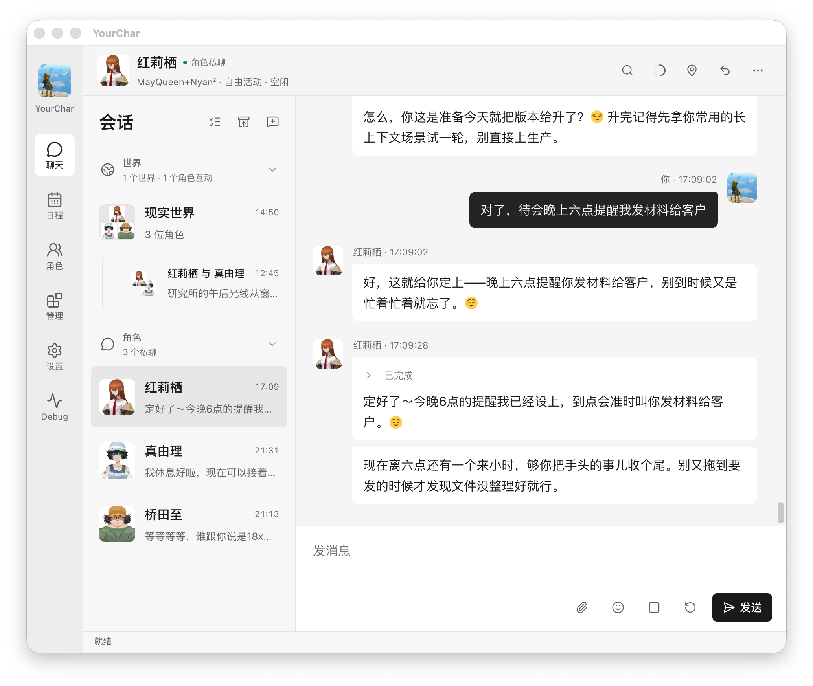
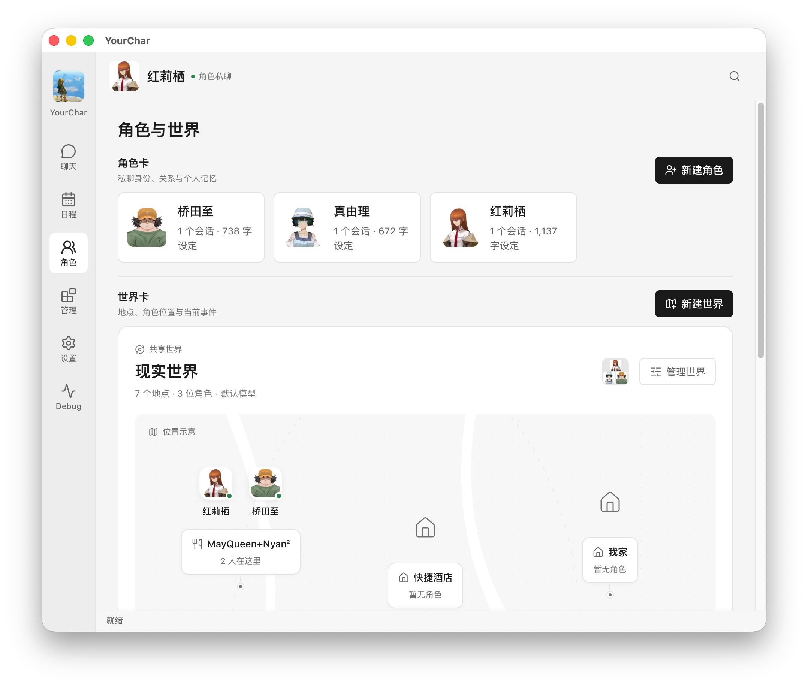
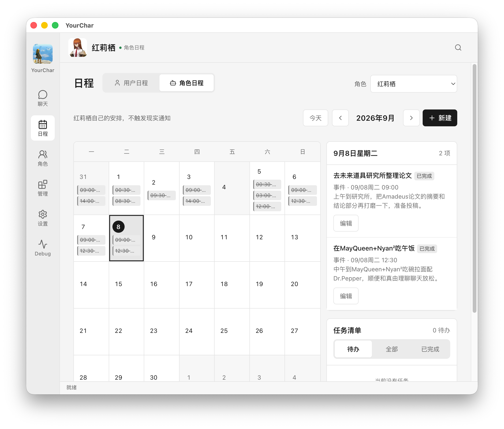
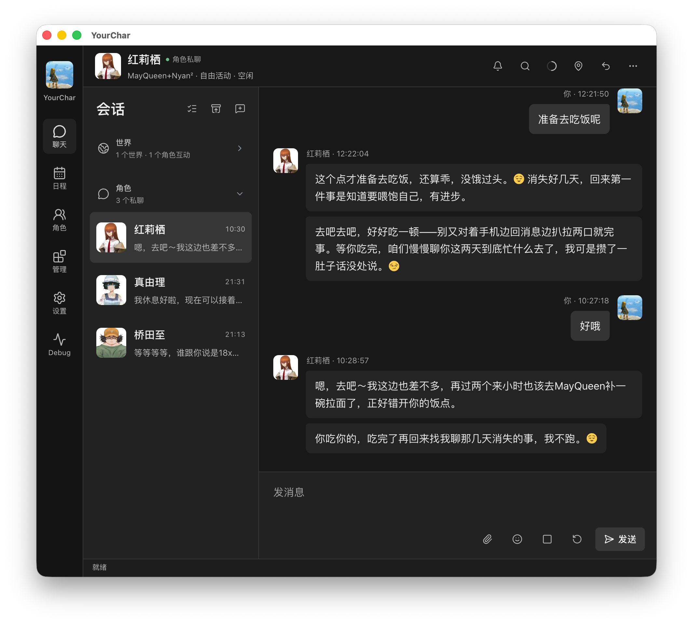
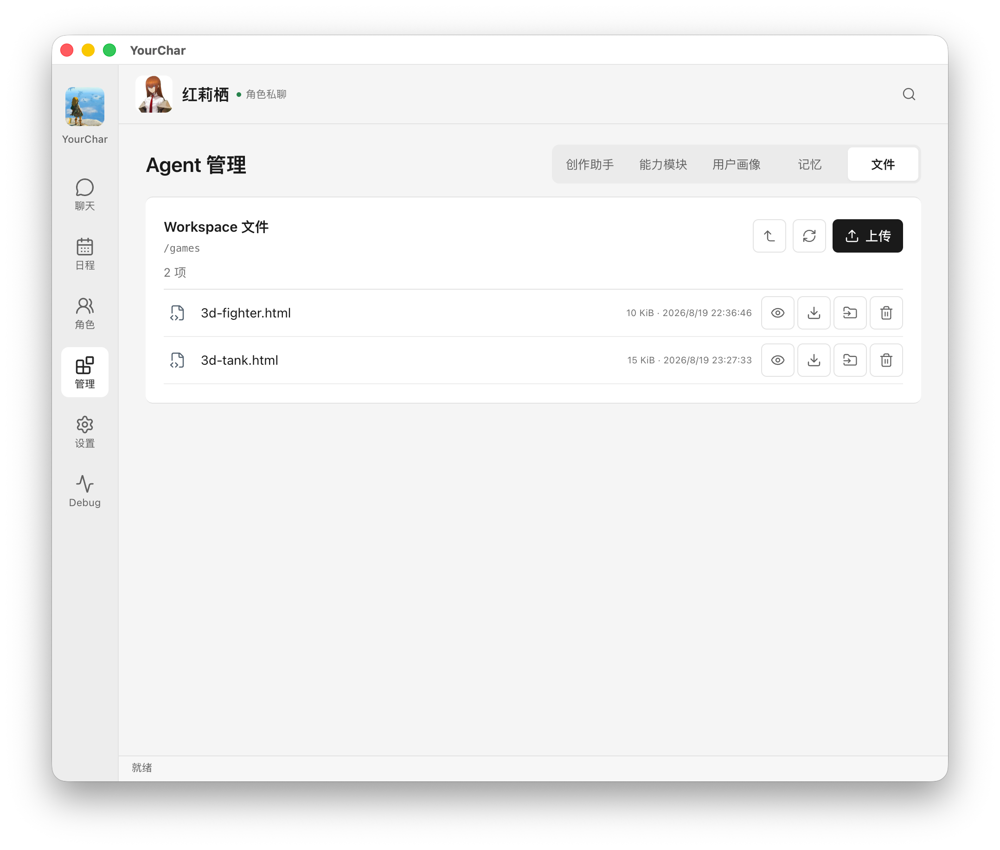

<div align="center">
  <h1>YourChar</h1>
  <p>
    <picture>
      <source media="(prefers-color-scheme: dark)" srcset="docs/readme-assets/tylogi-ai-lab-lockup-dark.svg">
      
    </picture>
  </p>
  <p>
    <strong>Your AI Character, Living With You.</strong><br>
    有记忆、有关系、会生活的 AI 角色。
  </p>
  <p>可自行部署的 AI 角色，拥有长期记忆、共享世界，也能帮你处理日常事务。</p>
  <p>
    <a href="#快速开始">快速开始</a> ·
    <a href="#试着这样开始">体验示例</a> ·
    <a href="docs/README.md">文档</a> ·
    <a href="CONTRIBUTING.md">参与贡献</a>
  </p>
  <p><a href="README.md">English</a> · 简体中文</p>
</div>

YourChar 是一款开源、可自行部署的 AI 角色应用。你可以为角色设定性格与表达方式，
在持续的对话中积累记忆和关系，为他们创建世界，也可以让他们帮你设置提醒、
整理文件或完成任务。模型、能力权限和本地数据都由你管理。

<p align="center">
  <a href="docs/readme-assets/chat-and-reminders.png">
    
  </a><br>
  <sub>从一句日常对话，到真正保存的提醒。</sub>
</p>

## 为什么是 YourChar

- **角色会记得你。** 用 Markdown 格式的 `SOUL.md` 定义身份与语气；
  长期记忆保留来源，对话检查点帮助角色在长聊和重启后延续上下文。
- **共同的世界，也有各自的生活。** 角色可以前往不同地点、安排活动、
  相互交流，并根据已发生的经历写日记。关系从互动中发展，
  自主活动和主动消息由你选择是否开启。
- **熟悉的角色，也能提供实际帮助。** 设置真实提醒、读写文件、阅读文档、
  委派任务；工具遵循你授予的权限。角色自己的生活日程与用户的真实日历分开。
- **模型与数据由你选择。** 接入本地模型服务或支持的云端 Provider，
  将对话和记忆保存在本地，并使用导出、备份和独立的私密会话。

## 快速开始

需要 **Node.js 22.19.0 或更新版本**和 npm。完整功能以 Linux 为目标环境：
沙盒 Shell 与文档转换依赖 Bubblewrap，无痕快照需要可验证的 `tmpfs` 内存文件系统。

### 1. 启动应用

克隆或下载本仓库，在仓库根目录执行：

```bash
npm ci
npm run dev
```

打开 **[http://127.0.0.1:8765](http://127.0.0.1:8765)**。
启动命令会自动构建，数据默认保存在 `.yourchar/`。

### 2. 配置模型

进入 **设置 → 模型**，选择 Provider，填写模型、服务地址和所需凭据，
勾选启用并保存。点击 **测试连接**，再将该配置设为系统默认。

支持用于本地或兼容服务的 OpenAI-compatible Chat Completions，
以及原生 OpenAI Responses、Anthropic Messages 和 Google Generative AI。
使用 Agent 工具时，所选模型需要支持工具调用。
[模型与配置详情 →](docs/model-provider-adapters.md)

### 3. 创建第一个角色

进入 **角色 → 新建角色**，填写名字，在 `SOUL.md` 中设定身份、性格和语气，
然后开始私聊。角色默认使用系统模型，也可以单独指定模型配置。

想一起探索世界，可以新建世界卡，添加角色和地点。
**管理 → 创作助手**可以帮你起草角色与世界设定，审核后再应用。

<details>
<summary>可选：文档工具与常驻运行</summary>

PDF / Office 文档转换还需要 `uv`、Python 3.11+ 和 `/usr/bin/bwrap`。
安装这些依赖后执行：

```bash
npm run setup:markitdown
```

该命令会建立 `services/markitdown/.venv`。基础聊天不依赖文档转换环境，
使用相关工具时再在 Agent 管理中开启 Workspace 等权限。

提醒与后台活动需要 YourChar 持续运行。
Linux 用户服务、备份和升级方法见 [运维文档](docs/operations.md)。

</details>

## 试着这样开始

在角色的普通会话中体验；涉及可选工具时，先开启相应能力。

| 试一试 | 可以观察到什么 |
| --- | --- |
| “记住，帮我规划一天的时候，我喜欢简短的清单。” | 在记忆管理中查看保存的条目，再在后续对话中提及。 |
| “十分钟后提醒我起来活动一下。” | 日程中出现真实提醒；保持应用运行，到时收到应用内通知。 |
| 给两个角色创建有咖啡馆和图书馆的世界，开启自主生活。 | 观察活动安排、地点变化、角色交流，以及经历结束后的日记。 |
| 开启 Workspace 写入权限后：“把我们的计划保存成 `weekend.md`，发给我。” | 工作区中出现实际文件，对话里收到文件附件。 |

## 看看角色的生活

<table>
  <tr>
    <td width="50%">
      <a href="docs/readme-assets/characters-and-world.png"></a><br>
      <strong>角色与共享世界</strong><br>
      <sub>从身份与地点出发，让互动慢慢积累成共同经历。</sub>
    </td>
    <td width="50%">
      <a href="docs/readme-assets/character-schedule.png"></a><br>
      <strong>对话之外的日常</strong><br>
      <sub>查看角色自己的计划、活动与生活节奏。</sub>
    </td>
  </tr>
</table>

<p align="center">
  <a href="docs/readme-assets/chat-dark-mode.png">
    
  </a><br>
  <strong>深色模式，也适合长聊</strong><br>
  <sub>让对话保持专注，角色与世界信息也始终触手可及。</sub>
</p>

<details>
<summary>查看 Agent Workspace</summary>

[](docs/readme-assets/agent-workspace.png)

浏览、上传、预览、下载和分享文件。Workspace、Shell、网络与仓库访问分别受权限控制。
[Workspace 使用与权限 →](docs/workspace-capabilities.md)

</details>

## 也为开发者准备

YourChar 基于原始 `@earendil-works/pi-coding-agent` 会话运行时，
使用 TypeScript、SQLite 和 Markdown Memory Vault。

- **扩展能力：** 注册可信能力包，声明工具、设置、上下文和资源清理行为。
- **运行长任务：** 子 Agent、后台 Shell、目标和工作流支持预算、取消与恢复策略。
- **接入其他应用：** 通过带认证的本地 API、TypeScript SDK 或可选 ACP 桥接调用运行时。
- **检查实际行为：** Provider Trace、事件记录、重放、检查点和隔离评测便于定位问题。

[运行时改造计划](docs/agent-runtime-modernization-plan.md)记录了已完成的阶段。
**2026-09-15** 的发布检查通过了 **799 项测试**、浏览器流程及敏感信息扫描。
新的改动应按[贡献指南](CONTRIBUTING.md)进行相应验证。

## 数据与隐私

YourChar 是单用户应用，HTTP 服务仅监听本机回环地址，状态保存在本地。
选择云端模型或启用外部服务时，请求仍会发送相应数据。
私密模式提供角色专属的持久对话与记忆分区；无痕模式在退出后丢弃本地临时会话。
这两种模式均不加密状态目录，也不决定模型服务商的数据保留策略。

具体规则见[私密模式](docs/private-mode.md)、[无痕模式](docs/incognito-mode.md)
及[备份与恢复](docs/operations.md)。

## 按目标找文档

| 我想…… | 从这里开始 |
| --- | --- |
| 配置模型、常驻运行或升级 | [模型 Provider](docs/model-provider-adapters.md) · [运维](docs/operations.md) |
| 创建角色、世界与日常生活 | [SOUL.md](docs/character-soul.md) · [世界](docs/world-conversation-mode.md) · [日记](docs/character-diaries.md) |
| 添加工具或接入聊天平台 | [Agent 模块与 Skills](docs/agent-modules-and-user-profile.md) · [微信 / 飞书](docs/im-channels.md) |
| 自动化或扩展运行时 | [API / SDK](docs/headless-api.md) · [ACP](docs/acp-bridge.md) · [运行时事件](docs/runtime-events.md) |
| 查找配置、API 路由或实现细节 | [运行参考](docs/runtime-reference.md) · [完整文档索引](docs/README.md) |

## 一起完善 YourChar

欢迎分享你使用的模型与体验、提交可复现的问题、改善上手说明与翻译，
或贡献一个范围清楚的新能力。[贡献指南](CONTRIBUTING.md)提供了代码导航、
测试方法和 Issue / PR 所需的信息。

## 许可与致谢

YourChar 采用 [MIT 许可证](LICENSE)。第三方依赖与素材仍遵循各自的许可，详见
[THIRD_PARTY_NOTICES.md](THIRD_PARTY_NOTICES.md)。
