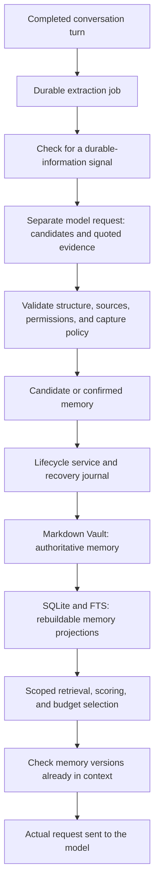

# Building a reliable agent memory system

Engineering lessons from YourChar · Tylogi AI Lab · 2026-09-17 (updated 2026-09-18)

English · [简体中文](building-reliable-agent-memory.md)

[YourChar project](../../README.md) · [Documentation](../README.md) · [Source on GitHub](https://github.com/Tylogi/YourChar) · [Jump to the lab](#hands-on-lab)

A user tells an AI assistant, “I don't eat cilantro.” A few days later, the
assistant remembers this when planning dinner. That is a useful memory demo.

Now go one step further. When the user changes that preference, when should the
old record stop applying? Could a fictional detail from roleplay become a fact
about the real user? Will retrying a background extraction job create duplicate
records? If the process exits halfway through updating two memory files, which
version should the next startup trust?

These questions determine whether a memory system can remain useful over time.
Retrieval quality affects what it remembers. Evidence, permissions, lifecycle
rules, and storage consistency determine whether those memories deserve trust.

This tutorial follows a preference through the open-source **YourChar**
implementation, from capture to context invalidation and crash recovery. The
patterns also apply to personal assistants, long-running agents, and
multi-character applications. You should be familiar with basic agent and
database concepts. A local lab near the end needs no model API key.

The implementation baseline is commit `81f33b5`. All conversations below are
synthetic examples. Code marked as a simplified sketch explains the design;
it is not a complete document you can import into the Vault.

## Reading paths

- **Design the write path:** [memory contracts](#memory-contract), [candidates and confirmation](#capture), [correction and forgetting](#lifecycle).
- **Keep it useful over time:** [authoritative storage](#source-of-truth), [crash recovery](#recovery), [explainable retrieval](#retrieval), [context invalidation](#context).
- **Try it yourself:** [retractable insights](#insights), [the no-API-key lab](#hands-on-lab), [applying the design to your agent](#apply-it).

<a id="memory-contract"></a>

## 1. Define what can become a memory

A chat log records what was said. Long-term memory must also describe a fact's
current status, its source, and who may use it. Start with a few contracts:

| Contract | Implementation requirement |
| --- | --- |
| Traceable evidence | Preserve the source session, message, and confirmation method; check the user's original words for automatic daily-chat capture |
| Explicit scope | Separate reality, character fiction, normal conversations, and a character's private space |
| A lifecycle | Treat candidates, active records, replacements, rejections, archives, and forgotten memories differently |
| Correction | Once a replacement is active, stop injecting the old version as valid memory |
| Recovery | Restore interrupted multi-file updates to a complete state |
| Explainability | Show why a memory was retrieved or excluded from context |

In YourChar, these contracts are enforced across types, file parsing, services,
database queries, and model-context assembly. The system prompt describes
boundaries too, but the data path must check them.

Here is a **simplified sketch** of the field relationships:

```ts
type Memory = {
  id: string;
  realm: "reality" | "roleplay" | "legacy";
  conversationSpace: "normal" | "secret";
  characterId?: string;
  secretOwnerCharacterId?: string;
  key?: string;
  content: string;
  sourceSessionId?: string;
  sourceMessageId?: string;
  validity: "pending" | "active" | "superseded"
    | "rejected" | "archived" | "deleted";
  confirmed: boolean;
  confidence: number;
  salience: number;
};
```

`realm` describes the nature of the information: `reality` contains real user
facts, preferences, and goals; `roleplay` contains a character's relationships,
world, and story continuity; `legacy` quarantines compatibility data from normal
retrieval. `conversationSpace` is a separate dimension that partitions normal
content from a particular character's private content.

In a roleplay session, “I am a captain in this story” does not gain permission to
write reality memory just because it contains “I am.” The runtime binds the
extraction job to a realm; model output cannot change it. Character memories
must have a valid character owner, and private memories must identify their
private-space owner.

See the [memory types](../../src/rp/types.ts),
[Vault metadata](../../src/memory-vault/types.ts), and
[MemoryLifecycleService](../../src/memory-coordinator/lifecycle.ts).

<a id="capture"></a>

## 2. Let the model propose; let the application decide

The main data path looks like this. Explicit “remember” commands and manual
confirmation are omitted from the diagram; they also enter the lifecycle service.



After each conversation turn, the Coordinator records a job or a reason for
skipping extraction. Local rules can skip messages such as “okay” or “I'm a
little tired today.” Signals about stable preferences, routines, projects,
people, or goals can proceed to extraction. This reduces extra model calls and
distinguishes “nothing worth remembering” from “extraction failed.”

The extractor makes a separate model request with no tools. It does not append
“please summarize the user” to the active conversation. The result must pass a
strict schema, contain at most eight candidates, and use types allowed by the
job's bound realm.

Suppose the user says `我平时工作日早上七点起床，不吃香菜。`:
“I usually get up at seven on weekdays, and I don't eat cilantro.” The model
could propose the following. This is an extraction-protocol example, not an
already-active storage record:

```json
{
  "candidates": [
    {
      "type": "preference",
      "key": "preference.food.cilantro",
      "content": "用户不吃香菜",
      "confidence": 0.97,
      "evidence": { "user": "不吃香菜" }
    }
  ]
}
```

The application checks that the evidence really occurs in the current user's
message, using a substring check after whitespace normalization. Automatic
capture also requires a confidence of at least `0.88` and passing sensitive-data
rules. The stored body is the verified original quote, not the model's rewritten
`content`. Here, `不吃香菜` means “don't eat cilantro.”

This helps reduce self-contamination: an assistant should not invent a user
preference and later record its own statement as evidence. A matching quote only
proves that something was said, however. It does not establish objective truth
or fully resolve sarcasm, negation, and quoted speech. `0.88` is a policy
threshold; model-reported confidence is not a calibrated probability of correctness.

Different entry points have different authority:

| Entry point | Capture policy |
| --- | --- |
| Model calls `propose_memory` | Always an unconfirmed candidate; the model cannot approve it |
| Background daily-chat extraction | Eligible quotes from normal reality conversations enter User Insight; activation depends on write permissions and capture policy, otherwise the corresponding observation or candidate state is retained |
| User issues a supported explicit “remember…” command | The backend recognizes current-user authorization and records its source |
| User confirms or corrects a memory in the management UI | Uses the trusted control path and records the confirmation source |

Sensitive information does not become active just because the model assigns it
a high score. The extraction prompt asks the model to omit it; if a candidate
still appears, the backend prevents it from passing daily automatic confirmation.
These are conservative lexical checks, not a complete data-loss-prevention system.

Extraction also needs idempotency. A job key derives from the source turn, and
candidate keys derive from the job and candidate index. Retrying the same job
does not create another copy of the same candidate merely because it ran again.
Across turns, stable semantic keys and normalized content help deduplicate facts.
This still depends on consistent keys; it does not solve arbitrary natural-language
semantic deduplication.

See the [Coordinator](../../src/memory-coordinator/coordinator.ts),
[extraction protocol](../../src/memory-coordinator/extractor.ts), and
[agent memory tools](../../src/mcp/memory-server.ts).

<a id="lifecycle"></a>

## 3. Make correction and forgetting first-class operations

An append-only memory feature will accumulate conflicts. If a user first says
“I get up at seven on weekdays” and later changes it to eight in the management
UI, the replacement should be explicit:

```text
memory-A: gets up at seven on weekdays → superseded
memory-B: gets up at eight on weekdays → active, confirmed
memory-B records supersedes = memory-A
```

Correcting an active memory in YourChar creates a new ID and marks the old record
`superseded`. Confirming a conflicting fact with the same key in the same scope
can also use the replacement path. The old record, new record, and any affected
user-profile projection are committed in one Vault operation.

“Same scope” must include conversation space, private owner, realm, and character
ownership. Otherwise, two characters' separate `relationship.promise` entries
could overwrite one another. A key identifies a fact slot within a scope, not an
unconditionally unique global name.

| State | Meaning | Eligible for long-term memory injection? |
| --- | --- | --- |
| `pending` | Candidate awaiting confirmation | No |
| `active` and `confirmed` | Currently valid, confirmed record | Yes, subject to scope and retrieval checks |
| `superseded` | Replaced by a newer record | No |
| `rejected` | Rejected candidate | No |
| `archived` | Retained record withdrawn from everyday use | No |
| `deleted` | Memory-forgetting operation applied | No |

Natural-language forgetting must handle ambiguity too. If “forget that project”
matches several records, the current implementation asks the user to select one
in the management UI instead of deleting an arbitrary match.

The product semantics matter: **forgetting a memory is a soft delete.** It stops
the record from being retrieved and injected as active memory. The body remains
in Vault audit records and possibly local history. Original chat messages,
external backups, and data already sent to a model provider do not disappear
automatically. Use the relevant data-deletion workflow when removing application
data, and check exactly what that workflow covers.

Start with the [confirmation, correction, and forgetting implementation](../../src/memory-coordinator/lifecycle.ts).

<a id="source-of-truth"></a>

## 4. Choose an authoritative source for memory

YourChar uses a Markdown Vault as authoritative memory storage. Files contain
strict YAML metadata and a body, making them readable, portable, and editable
in tools such as Obsidian. Part of the layout is:

```text
<stateDir>/memory-vault/
├── reality/
│   ├── user-profile.md
│   ├── memories/<memory-id>.md
│   └── people/<person-id>.md
├── roleplay/
│   ├── characters/<character-id>/SOUL.md
│   ├── characters/<character-id>/memories/<memory-id>.md
│   └── scenes/<session-id>.md
├── secret/characters/<character-id>/memories/<memory-id>.md
└── legacy/quarantine/<memory-id>.md
```

SQLite memory rows and FTS indexes are projections of these documents. If the
index becomes inconsistent, the application can validate the Markdown and
rebuild the data needed for memory queries.

This choice has costs: file/database synchronization, version conflicts, and a
recovery protocol. If users do not need to edit files directly, a database can
be the sole authority instead. The transferable principle is to specify which
store owns each kind of data and how derived copies are rebuilt.

“The memory index is rebuildable” does **not** mean “the entire application
database is disposable.” Extraction jobs, schedules, and other application state
have their own persistence. The Vault does not contain all original conversations
and cannot restore the complete application on its own.

External editing introduces concurrency. After the application reads a document,
a user may change its body or metadata in an editor. Writes therefore check the
expected revision and a hash of the **entire document**: a compare-and-swap check.
A mismatch reports a conflict instead of overwriting a changed file. Comparing
only the body would miss changes to permissions, status, and other metadata.

Valid external changes are accepted during safe synchronization, which updates
the index. Invalid structures, duplicate IDs, incorrect paths, and symbolic links
are rejected. External editors do not obey the application's writer lease, so
avoid concurrent overwrites by multiple programs. This detects version conflicts
observed by the application; it is not a general collaborative-editing protocol.

See [file storage and CAS](../../src/memory-vault/store.ts),
[strict document parsing](../../src/memory-vault/codec.ts), and the
[Vault synchronization service](../../src/memory-vault/service.ts).

<a id="recovery"></a>

## 5. Design for a write that stops halfway through

One correction may invalidate an old memory, activate a replacement, remove a
sentence from the profile, and update SQLite and FTS. A database transaction
cannot atomically include all Markdown files. An atomic rename of one file does
not make a multi-file operation atomic either.

YourChar uses an application-level operation journal with these durable stages:

```text
prepared
  → files_committed
  → projection_committed
  → state_committed
  → completed
```

`prepared` saves a before snapshot. After writing the Vault files, the operation
saves an after snapshot and advances its stage. Database projections, projection
state, and compatibility copies follow. Individual file writes use a complete
write loop, file `fsync`, atomic rename, and parent-directory `fsync`. The journal
records paths, sizes, and SHA-256 hashes so recovery can verify snapshots.

| Durable record at interruption | Recovery target |
| --- | --- |
| `prepared`, or no after record yet | Restore the complete before snapshot |
| `files_committed`, `projection_committed`, or `state_committed`, with a verified after snapshot | Restore the complete after snapshot |
| `completed` or `rolled_back` | Terminal operation; no replay needed |
| Required snapshot is corrupt or its hash does not match | Report recovery failure; do not resume normal startup with corrupt data treated as valid |

Recovery follows the persisted stage, not whichever files look recently changed.
Even if a file has been renamed after `prepared`, recovery must return to before
unless the operation has advanced to a stage with an after snapshot.

After recovery, documents must be validated, memory projections rebuilt, and
compatibility copies aligned before normal context assembly resumes. Repeating
recovery should converge to the same state.

Stale processes must also lose permission to write. YourChar manages a
single-writer lease in SQLite and uses an increasing fencing token to identify
the current writer. After a new process takes over an expired lease, the old
process must revalidate its authority at subsequent commit points; resuming does
not let it keep committing with an old token. Background extraction jobs have
separate owners, claim tokens, and renewal, so late model results cannot overwrite
work that another worker has taken over.

These guarantees assume the same local filesystem and SQLite database,
reasonably consistent clocks, and the filesystem's actual durability semantics.
They are not a consensus protocol for multiple machines or network filesystems.

After a successful commit, the application also attempts a local Git history
checkpoint for inspecting and restoring semantic versions. This repository has
no remote, and character agents cannot access it as a Workspace repository.
A history-layer failure does not undo an already-completed authoritative write.
Recovery journals, version history, and verified backups solve different problems.

See the [operation journal](../../src/memory-vault/journal.ts),
[durable writes](../../src/memory-vault/durability.ts),
[writer lease](../../src/memory-vault/writer-lock.ts), and
[local version history](../../src/memory-vault/history.ts).
[Memory R5](../memory-architecture-r5.md) describes the recovery and backup contracts
in more detail; that reference is currently in Chinese.

<a id="retrieval"></a>

## 6. Make retrieval explainable

Once storage is reliable, decide what should be recalled now. YourChar currently
uses lexical retrieval: key, tag, and body matches; SQLite FTS5/BM25; and token
overlap including Chinese bigrams. There is no embedding index or neural reranker
in this path.

Automatic retrieval restricts candidates by space, realm, character, validity,
and confirmation before calculating relevance. For person records in normal
reality memory, context assembly also checks the person profile's character
visibility. Private information must not enter the wrong conversation merely
because it scored well. Scope checks are independent of relevance.

Query normalization removes some conversational phrasing, such as the Chinese
equivalent of “do you remember…?” Daily capture can add rule-based tags such as
`作息` (routine), `忌口` (dietary restrictions), and `回复偏好` (response preference).
These help a query about routines and dietary restrictions find “gets up at seven
on weekdays” and “doesn't eat cilantro.” They are limited rule expansions, not
general semantic understanding.

Relevance takes the maximum of several signals, then contributes to a total score:

```text
relevance = max(
  body match ? 1.00 : 0,
  key match ? 0.95 : 0,
  tag match ? 0.90 : 0,
  FTS hit ? 0.72 + 0.08 × normalizedBm25 : 0,
  0.80 × lexicalOverlap
)

score = 0.60 × relevance
      + 0.18 × salience
      + 0.10 × recency
      + 0.12 × confidence

recency = 1 / (1 + ageDays / 30)
```

These weights are the current engineering policy, not universally optimal
parameters. Ordinary candidates need relevance of at least `0.24`. If none are
relevant, the system does not inject an arbitrary memory to fill a quota. A new
session gets one core-memory bootstrap opportunity: within budget, it can add up
to three confirmed memories with high salience or a `core` tag. A preview does
not consume that opportunity.

There is also a scaling limit. Automatic recall first selects at most 100
candidates using criteria such as salience and usage time, then uses FTS scores
to help rank that pool. An FTS hit outside the pool does not automatically expand
it. As memory grows, evaluate this cap and candidate generation against missed
retrieval examples.

The model can call `search_memory` for additional queries. That tool currently
uses repository-level `LIKE`/FTS queries, a different path from automatic context
ranking. When debugging, distinguish the preview's selection from what a model
actually found through a tool call.

See [automatic retrieval and scoring](../../src/context/memory-retriever.ts)
and [database queries](../../src/rp/repository.ts).

<a id="context"></a>

## 7. Manage memory already present in context

A common omission: the database is corrected, but the old injected text is still
in the conversation history sent to the model. Retrieving the new version can
leave the model looking at both.

YourChar tracks the IDs and version digests of memories resident in context.
The digest covers injection-relevant fields, including content, scope, status,
and tags. Before assembling an actual request, the runtime rebuilds this state
from currently valid memories and the messages that remain, then removes stale
memory carriers.

This serves two purposes: do not inject a version already present, and do not
retain an invalid version after correction, forgetting, external edits, or
disabling the memory module. If conversation compaction removes a carrier, its
resident marker must also be cleared so a relevant query can recall it again.

Budgets control how much memory can be added each turn:

| Component | Default budget |
| --- | ---: |
| Total automatically planned memory text | 360 estimated tokens |
| Reality memory | 220 estimated tokens, at most 3 entries |
| Current character's roleplay memory | 220 estimated tokens, at most 3 entries |
| Overall dynamic context in the planner | 900 estimated tokens |

When both realms appear, the combined 360-token limit still applies. Accounting
includes the text wrapping memory entries. Over-budget facts are removed whole,
not truncated mid-sentence. Facts duplicated in the user's handwritten profile
are excluded; automatically managed profile sections remain available for human
inspection and editing without becoming a second injection path.

These are local defaults for automatic context planning. They are not the size
of the model's context window, nor a total cap on resident memories from previous
turns, original conversation, tool results, or additional visual inputs. Window
budgets and compaction still manage the overall session. Estimated tokens are
recorded separately from provider-reported usage; estimates are not presented as
actual usage when the provider reports none.

Version invalidation applies to memory carriers injected by the application.
It does not rewrite what users previously said or prove that a remote provider
deleted received data. Specify which layer you mean when testing “forgetting.”

See [context planning](../../src/context/planner.ts),
[memory versions](../../src/context/memory-version.ts), and the
[session runtime](../../src/pi/session-runtime.ts).

<a id="insights"></a>

## 8. Build retractable insights from observations

Long-running applications also collect schedule and behavior data. One request
to “remind me to read a paper” should not become “the user reads papers every day.”
YourChar models this separately as User Insight: store observations first, then
decide whether they support a limited conclusion.

For example, the repeated-task-completion rule requires at least three local
dates spanning at least seven days within a 90-day window. Its output says that
the user completed this activity on multiple dates, rather than inferring a
profession, personality, or permanent habit. One-off schedules, fictional
character schedules, and sensitive content do not become user-profile traits
through this path.

Automatic insights can become inactive when evidence is withdrawn, a rule stops
being satisfied, or a relevant conflict appears. If a user manually corrects or
blocks an insight, background processing must not keep restoring the old claim.
User intervention becomes state that future computation must respect.

Person memory has a separate organization layer too. Confirmed `person` facts
can be consolidated into editable Markdown profiles while retaining source
memory IDs, names, aliases, and visibility. Queries receive short excerpts as
needed. Keeping the link between evidence and profiles prevents summaries from
turning into descriptions with no traceable source.

See [User Insight](../../src/user-insight/coordinator.ts) and
[person-profile consolidation](../../src/memory-vault/service.ts).

<a id="hands-on-lab"></a>

## 9. Test recall, correction, and forgetting yourself

This lab uses the repository's isolated test runtime and a scripted model.
It makes no real model-service requests and does not read your existing personal
Vault. It tests whether the application sends the correct version to the model;
natural-language extraction quality needs separate real-model evaluation.

Both language editions deliberately use the same Chinese fixtures so translation
does not change the current rule-based capture and retrieval behavior.
`不吃香菜` means “don't eat cilantro,” `我的忌口是什么？` asks “what are my dietary
restrictions?”, and `我现在可以吃香菜` means “I can eat cilantro now.”

Install dependencies and build from the repository root. See the project README
for the required Node.js version:

```bash
npm ci
npm run build
```

Then run this in a shell supporting heredocs, such as Bash or Zsh:

```bash
node --disable-warning=ExperimentalWarning --input-type=module <<'NODE'
import assert from 'node:assert/strict';
import { createTestRuntime } from './dist/src/testing/runtime.js';

const runtime = createTestRuntime({
  seed: 'memory-blog-demo',
  memoryExtractor: async ({ userText }) => ({
    candidates: userText.includes('不吃香菜') ? [{
      type: 'preference',
      key: 'preference.food.cilantro',
      content: '用户不吃香菜',
      confidence: 0.97,
      evidence: { user: '不吃香菜' },
    }] : [],
  }),
});

try {
  runtime.kernel.patchAgentPermissions({ realityMemoryWriteEnabled: true });
  runtime.model.enqueue(Array.from({ length: 4 }, () => ({
    kind: 'assistant_text', text: '收到。',
  })));

  await runtime.kernel.sendMessage('blog-source', {
    mode: 'sms', text: '我平时不吃香菜。',
  });
  await runtime.kernel.memoryCoordinator.drain();
  const original = runtime.kernel.listMemories({
    realm: 'reality', validity: 'active',
  }).find(memory => memory.content === '不吃香菜');
  assert.ok(original?.confirmed);

  const ask = () => runtime.kernel.sendMessage('blog-recall', {
    mode: 'sms', text: '我的忌口是什么？',
  });
  const payload = () => JSON.stringify(runtime.model.requests.at(-1)?.messages);

  await ask();
  assert.match(payload(), /不吃香菜/);

  const corrected = runtime.kernel.correctMemory(original.id, {
    content: '我现在可以吃香菜',
  }).memory;
  await ask();
  assert.doesNotMatch(payload(), /不吃香菜/);
  assert.match(payload(), /我现在可以吃香菜/);

  runtime.kernel.forgetMemory(corrected.id);
  await ask();
  assert.doesNotMatch(payload(), /不吃香菜|我现在可以吃香菜/);
  await runtime.kernel.memoryCoordinator.drain();
  console.log('PASS：跨会话召回、纠错失效、遗忘失效');
} finally {
  runtime.dispose();
}
NODE
```

On success, the final line reports `PASS` for cross-session recall and
invalidation after correction and forgetting. Writing and querying use separate
sessions, and scripted replies do not repeat the preference, so its presence in
the query request should come from memory injection. `correctMemory` and
`forgetMemory` simulate trusted control-path operations; they do not grant
ordinary model tools permission to confirm or delete records directly.

Continue with the existing reliability tests:

```bash
node --disable-warning=ExperimentalWarning --test \
  dist/test/memory-daily-effectiveness.test.js \
  dist/test/context-planner-r4.test.js \
  dist/test/secret-memory-isolation.test.js \
  dist/test/user-insight.test.js

npm run test:memory-durability
```

These cover automatic capture and negative cases, stale-version removal from
actual requests, space isolation, insight retraction, and recovery after fault
injection. Durability tests also cover competing writers, expired-lease takeover,
interrupted corrections, consistency between forgetting and profiles, and
refusing to overwrite a restore target when a backup is corrupt. See the full
assertions in the [memory durability tests](../../test/memory-durability-r5.test.ts).

For retrieval debugging, start with query previews in the management UI. The
read-only endpoints are `/api/v1/context-plan/preview` and
`/api/v1/memory-retrieval/preview`. Context-economy metrics retain scores, selected
IDs, budgets, and exclusion reasons. Previews do not count as actual hits or
update memory usage time. “Why didn't it remember?” can then be narrowed down to
capture, scope, relevance, budget, or the same version already being in context.

Report engineering assertions separately from model quality. The repository
also provides `npm run eval:memory-daily`, which sends synthetic examples to a
configured compatible model endpoint and evaluates type coverage, quoted
evidence, and negative cases. It requires model configuration and makes actual
inference calls. Passing a scripted-model test is not evidence that every model
can extract memories accurately.

<a id="apply-it"></a>

## Apply the design to your own agent

Build in dependency order. Define sources, scope, and state first. Add candidates
and confirmation, same-scope correction, and idempotent writes. Then implement
explainable retrieval and budgets, and verify that stale memories disappear from
the next request. Finally, add recovery, writer coordination, and backup
verification appropriate to your storage. Give each step a concrete failure
scenario to test.

YourChar still has limitations to measure and improve. Lexical retrieval can
miss semantically related queries with different wording, the candidate pool is
bounded, and daily-information and sensitive-data rules cannot cover every
expression. Future vector retrieval or reranking should be evaluated against
real missed-retrieval examples while preserving evidence, scope, confirmation,
and version-invalidation constraints.

The useful lesson here is how model extraction, user control, context management,
and storage recovery form one inspectable data path. Start with the
[YourChar source](https://github.com/Tylogi/YourChar) and the lab above: save a fact,
correct it, forget it, and test an interrupted write. Reproducible failures and
improvements are welcome, so these designs can be tested with more models and
longer real-world use.

[Run the local lab](#hands-on-lab) · [Try YourChar](../../README.md#quick-start) · [Report an issue or contribute](../../CONTRIBUTING.md) · [中文版](building-reliable-agent-memory.md)
