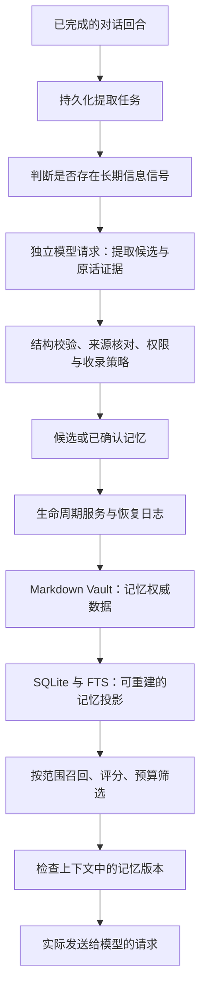

# 如何构建可靠的 Agent 记忆系统

YourChar 的工程实践 · Tylogi AI Lab · 2026-09-17（更新：2026-09-18）

简体中文 · [English](building-reliable-agent-memory.en.md)

[YourChar 项目](../../README.zh-CN.md) · [文档目录](../README.md) · [GitHub 源码](https://github.com/Tylogi/YourChar) · [直接运行实验](#hands-on-lab)

用户告诉 AI：“我平时不吃香菜。”几天后，让它安排一顿晚餐，它能想起这句话。这是一个不错的记忆演示。

再往下走一步：用户修改了偏好，旧记录应该什么时候失效？一条角色扮演中的设定，会不会被当成用户的现实经历？后台提取任务重试，会不会重复存储？修改两份记忆文件时进程突然退出，下次启动该相信哪一份？

这些问题决定了一个记忆系统能否被长期使用。检索质量影响“想不想得起来”，证据、权限、生命周期和存储一致性则决定“想起来的东西是否值得相信”。

本文以开源项目 **YourChar** 的实现为例，从一条偏好的写入讲到上下文失效和崩溃恢复。你可以把这些设计用在个人助手、长期任务 Agent 或多角色应用中。文章面向已经做过简单 Agent、熟悉基本数据库操作的开发者；后面有一个无需模型 API Key 的本地实验。

实现基线为提交 `81f33b5`。文中的对话均为合成示例；标为“简化示意”的代码用于解释设计，不能直接作为完整 Vault 文档导入。

## 阅读路线

- **设计写入规则：** [记忆契约](#memory-contract)、[候选与确认](#capture)、[纠错与遗忘](#lifecycle)。
- **保证长期可用：** [权威存储](#source-of-truth)、[崩溃恢复](#recovery)、[可解释召回](#retrieval)、[上下文失效](#context)。
- **动手检验：** [可撤回的洞察](#insights)、[无需 API Key 的实验](#hands-on-lab)、[迁移到自己的 Agent](#apply-it)。

<a id="memory-contract"></a>

## 1. 先定义什么可以成为记忆

聊天记录保存“说过什么”，长期记忆还必须表达“这条信息现在处于什么状态、从哪里来、可以给谁使用”。我们先给记忆加上几个约束：

| 约束 | 对实现的要求 |
| --- | --- |
| 有来源 | 保留来源会话、来源消息，以及确认方式；日常自动收录要核对用户原话 |
| 有适用范围 | 区分现实、角色剧情、普通会话和角色私密空间 |
| 有生命周期 | 候选、已生效、被替换、拒绝、归档、遗忘分别处理 |
| 能纠正 | 新版本生效后，旧版本不能继续作为有效记忆注入 |
| 能恢复 | 中断后的多文件更新必须恢复成一个完整状态 |
| 能解释 | 能看出某条记忆为什么被召回、为什么没有进入上下文 |

在 YourChar 中，这些约束分布在类型、文件解析、业务服务、数据库查询和模型上下文组装中。系统提示词也会说明边界，但数据路径本身要检查边界。

以字段关系为例，下面是一个**简化示意**：

```ts
type Memory = {
  id: string;
  realm: "reality" | "roleplay" | "legacy";
  conversationSpace: "normal" | "secret";
  characterId?: string;
  secretOwnerCharacterId?: string;
  key?: string;
  content: string;
  sourceSessionId?: string;
  sourceMessageId?: string;
  validity: "pending" | "active" | "superseded"
    | "rejected" | "archived" | "deleted";
  confirmed: boolean;
  confidence: number;
  salience: number;
};
```

`realm` 表达信息的性质：`reality` 保存用户现实事实、偏好、目标等；`roleplay` 保存某个角色的关系、世界和剧情连续性；`legacy` 隔离历史兼容数据，不参与正常召回。`conversationSpace` 是另一个维度，决定普通内容与某个角色的私密内容如何分区。

因此，在 RP 会话里，“剧情里的我是一位船长”不会仅因为包含“我是”就获得写入现实记忆的权限。提取任务的 realm 由运行时绑定，模型输出不能修改它。角色记忆必须带合法的角色归属；私密记忆必须带私密空间的所有者。

完整类型和校验分别在 [记忆类型](../../src/rp/types.ts)、[Vault 元数据](../../src/memory-vault/types.ts) 和 [MemoryLifecycleService](../../src/memory-coordinator/lifecycle.ts)。

<a id="capture"></a>

## 2. 让模型提取候选，让程序决定如何收录

YourChar 的主要数据路径如下。图中省略了显式“记住”命令和人工确认入口，它们最终也进入同一个生命周期服务。



每轮对话结束后，Coordinator 先记录任务或跳过原因。像“好的”“我今天有点累”这样的消息，可以在本地规则阶段跳过；包含稳定偏好、作息、项目、人物或目标的表达，再进入提取器。这样既减少额外模型调用，也能区分“没有值得记的内容”和“提取失败”。

提取器使用独立、无工具的模型请求，不向正在聊天的会话追加一段“请总结用户”的对话。输出必须通过严格 schema，候选数量最多为 8 条，类型也必须符合任务绑定的 realm。

假设用户说：

> 我平时工作日早上七点起床，不吃香菜。

模型可以提出这样的候选；这是提取协议的示例，不是已经生效的存储记录：

```json
{
  "candidates": [
    {
      "type": "preference",
      "key": "preference.food.cilantro",
      "content": "用户不吃香菜",
      "confidence": 0.97,
      "evidence": { "user": "不吃香菜" }
    }
  ]
}
```

程序会检查证据是否确实是当前用户消息中的片段。当前实现对空白做规范化后进行包含检查；自动收录还要求置信度至少为 `0.88`，并通过敏感信息规则。真正保存的正文是核对过的用户原话，而不是模型润色后的 `content`。

这能减少“助手说用户喜欢咖啡，下一轮又把自己的话记成事实”之类的自我污染。不过，原话存在只证明它被说过，不证明它客观正确，也不能完全解决反讽、否定和引用歧义。`0.88` 是策略阈值，模型自报的数值并不是经过校准的正确概率。

不同入口有不同权限：

| 入口 | 收录方式 |
| --- | --- |
| 模型调用 `propose_memory` | 始终是未确认候选，不能自行批准 |
| 后台日常提取 | 普通现实会话的合格原话进入 User Insight；满足写权限和收录策略后可生效，否则保留相应观察或候选状态 |
| 用户明确发出支持的“记住……”命令 | 后端识别当前用户授权，记录显式授权来源 |
| 用户在管理界面确认或纠错 | 走可信控制面，记录确认来源 |

敏感信息不会因为模型给了高分就自动进入有效记忆。提取提示词要求忽略此类内容；即使模型仍返回了候选，后端也不会让它通过日常自动确认规则。这里的规则是保守的词法检查，不能把它当成完整的数据防泄漏系统。

提取任务还有一个容易被忽略的细节：幂等性。任务键来自来源回合，候选键来自任务与候选序号，重复执行同一任务不会仅因为重试就重复创建同一候选。跨回合的重复事实则借助稳定语义 key 和规范化内容去重；这仍依赖 key 的一致性，不能等同于解决了任意自然语言的语义去重。

实现入口：[Coordinator](../../src/memory-coordinator/coordinator.ts)、[提取协议](../../src/memory-coordinator/extractor.ts)、[Agent 记忆工具](../../src/mcp/memory-server.ts)。

<a id="lifecycle"></a>

## 3. 把纠错和遗忘当成正式操作

如果系统只会新增记忆，用得越久就越容易积累冲突。用户先说“工作日七点起床”，后来在管理界面改成“工作日八点起床”，应当产生可解释的替换关系：

```text
memory-A：工作日七点起床 → superseded
memory-B：工作日八点起床 → active、confirmed
memory-B 记录 supersedes = memory-A
```

对已生效的记忆，YourChar 的纠错会创建一个新的 ID，旧记录转为 `superseded`。相同范围内、相同 key 的确认冲突也能走替换流程。旧记录、新记录，以及需要更新的用户画像投影，在一次 Vault 操作中提交。

“相同范围”必须包含会话空间、私密所有者、realm 和角色归属。否则，两个角色各自的 `relationship.promise` 就可能互相覆盖。key 表达的是同一个范围内的事实槽位，不是全局无条件唯一的名字。

这些状态各有含义：

| 状态 | 含义 | 是否可作为长期记忆注入 |
| --- | --- | --- |
| `pending` | 等待确认的候选 | 否 |
| `active` 且 `confirmed` | 当前有效的已确认记录 | 是，还需满足范围和检索条件 |
| `superseded` | 已被新版本替代 | 否 |
| `rejected` | 被拒绝的候选 | 否 |
| `archived` | 保留记录，但退出日常使用 | 否 |
| `deleted` | 被执行了记忆遗忘操作 | 否 |

自然语言遗忘也需要处理歧义。“忘记那个项目”如果匹配到多条记录，当前实现会要求用户在管理界面选择，而不会随意删除其中一条。

这里必须把产品语义说准确：**记忆“遗忘”是软删除。** 它停止这条记录作为有效记忆被召回和注入，正文仍保留在 Vault 审计记录和可能存在的本地历史中。原始聊天中说过的话、外部备份和已经发送给模型服务商的数据，也不会因为这次操作自动消失。需要清理应用数据时，应使用对应的数据删除流程，并理解它的具体范围。

代码可从 [确认、纠错与遗忘](../../src/memory-coordinator/lifecycle.ts) 读起。

<a id="source-of-truth"></a>

## 4. 给记忆确定一个权威数据源

YourChar 选择 Markdown Vault 作为记忆的权威存储。文件由严格的 YAML 元数据和正文组成，方便用户阅读、迁移，以及在 Obsidian 一类编辑器中维护。部分目录如下：

```text
<stateDir>/memory-vault/
├── reality/
│   ├── user-profile.md
│   ├── memories/<memory-id>.md
│   └── people/<person-id>.md
├── roleplay/
│   ├── characters/<character-id>/SOUL.md
│   ├── characters/<character-id>/memories/<memory-id>.md
│   └── scenes/<session-id>.md
├── secret/characters/<character-id>/memories/<memory-id>.md
└── legacy/quarantine/<memory-id>.md
```

SQLite 中的记忆行和 FTS 索引由这些文档投影得到。索引不一致时，可以先验证 Markdown，再重建记忆查询所需的数据。

这个选择也有成本：文件和数据库之间需要同步、版本冲突处理以及恢复协议。如果你的应用不需要用户直接编辑文件，用数据库作为唯一权威源也可以。可迁移的原则是：每类数据明确由谁负责，派生副本按什么规则重建。

也不要把“记忆索引可重建”理解成“整个应用数据库可以丢掉”。提取任务、日程和其他业务状态仍有自己的持久化位置；Vault 不包含全部原始会话，也不能独自恢复完整应用。

外部编辑又带来了并发问题。应用读到文档后，用户可能在编辑器里改了正文或元数据。因此写入时会核对预期 revision 和**整份文档的哈希**，即 compare-and-swap：版本不符合预期，就报告冲突，而不是覆盖已经改变的文件。只比较正文会漏掉权限、状态等元数据的变化。

有效外部修改在安全同步时被接受，索引随之更新；无效结构、重复 ID、错误路径或符号链接则会被拒绝。外部编辑器不受应用写入租约控制，因此仍应避免多个程序并发覆盖同一文档。这套机制针对应用观察到的版本冲突，不是通用的多人协同编辑协议。

实现入口：[文件存储与 CAS](../../src/memory-vault/store.ts)、[严格文档解析](../../src/memory-vault/codec.ts)、[Vault 同步服务](../../src/memory-vault/service.ts)。

<a id="recovery"></a>

## 5. 为“写到一半”设计恢复路径

考虑一次纠错：旧记忆要失效，新记忆要生效，画像中的旧句子要移除，SQLite 和 FTS 也要更新。数据库事务不能把所有 Markdown 文件一起纳入原子提交；单个文件的原子 rename 也不能保证多个文件整体完成。

YourChar 为此使用应用层操作日志。一次修改经过这些持久化阶段：

```text
prepared
  → files_committed
  → projection_committed
  → state_committed
  → completed
```

`prepared` 保存操作前快照；Vault 文件写完后，保存操作后快照并推进阶段；随后提交数据库投影、投影状态和兼容副本。单文件写入包含完整写入循环、文件 `fsync`、原子 rename，以及父目录 `fsync`。日志记录路径、大小与 SHA-256，恢复时要验证快照。

重启时的决策可以写成下面这张表：

| 中断时的持久化记录 | 恢复目标 |
| --- | --- |
| `prepared`，或还没有 after 记录 | 恢复完整 before 快照 |
| `files_committed`、`projection_committed`、`state_committed`，且 after 校验通过 | 恢复完整 after 快照 |
| `completed` 或 `rolled_back` | 已终结，无需重放 |
| 需要的快照损坏、哈希不符 | 报告恢复失败，不把坏数据当作有效状态继续启动 |

关键是依据已经持久化的阶段恢复，而不是看目录里哪几个文件“似乎更新了”。在 `prepared` 后，即便一个文件已经 rename，只要操作还没推进到有 after 快照的阶段，恢复仍应回到 before。

恢复完成后，还要验证文档、重建记忆投影、对齐兼容副本，再允许正常上下文组装。重复执行恢复也应收敛到相同状态。

还需要防止过期进程继续写。YourChar 用 SQLite 管理单写入者租约，并使用递增的 fencing token 标识写入资格。新进程接管过期租约后，旧进程即使恢复运行，也必须在后续提交点重新验证资格，不能继续以旧 token 提交。后台提取任务另有 owner、claim token 和续租机制，防止迟到的模型结果覆盖已经被接管的工作。

这些保证有明确前提：同一套本地文件系统与 SQLite、合理一致的时钟，以及文件系统实际提供的持久化语义。不能直接把它推广成跨机器或网络文件系统上的共识协议。

此外，应用会在成功提交后尝试创建本地 Git 历史检查点，用来回看和恢复语义版本。这个仓库没有远端，角色 Agent 也不能把它当作 Workspace 仓库操作。历史层故障不会撤销已经完成的权威写入；恢复日志、版本历史和经过验证的备份分别解决不同问题。

实现入口：[操作日志](../../src/memory-vault/journal.ts)、[持久化写入](../../src/memory-vault/durability.ts)、[写入者租约](../../src/memory-vault/writer-lock.ts)、[本地版本历史](../../src/memory-vault/history.ts)。更完整的恢复与备份约定见 [Memory R5](../memory-architecture-r5.md)。

<a id="retrieval"></a>

## 6. 让召回过程可以解释

存储可靠之后，才轮到“这次应该想起什么”。YourChar 当前使用词法检索：Key、Tag、正文匹配，SQLite FTS5/BM25，以及包含中文二元词组的重叠评分。这里没有 Embedding 索引或神经重排器。

自动召回先按空间、realm、角色、有效性和确认状态限制候选，再计算相关性。普通现实记忆中的人物条目，还会在上下文整理路径上检查人物档案的角色可见范围。私密内容不能仅靠“分数很低”来避免进入错误会话，范围检查必须独立于相关性。

查询会去掉部分会话式表达，例如“还记得……吗”。日常收录时还会添加“作息”“忌口”“回复偏好”等规则标签，让“你还记得我的作息和忌口吗”更容易找到“工作日七点起床”和“不吃香菜”。这些是有限的规则扩展，不具备通用语义理解能力。

当前相关性取多个信号中的最大值，再计算总分：

```text
relevance = max(
  正文匹配 ? 1.00 : 0,
  key 匹配 ? 0.95 : 0,
  tag 匹配 ? 0.90 : 0,
  FTS 命中 ? 0.72 + 0.08 × normalizedBm25 : 0,
  0.80 × lexicalOverlap
)

score = 0.60 × relevance
      + 0.18 × salience
      + 0.10 × recency
      + 0.12 × confidence

recency = 1 / (1 + ageDays / 30)
```

这些权重是当前工程策略，不是适用于所有应用的最优参数。普通候选的相关性要达到 `0.24`；没有相关候选时，不为凑数量随便塞入一条。新会话有一次核心记忆初始化机会，可以在预算内补入最多 3 条高重要性或带 `core` 标签的已确认记忆；预览不会消耗这次机会。

还有一个实际的规模边界：当前自动召回先按重要性、使用时间等取最多 100 条候选，FTS 分数再参与这批候选的排序。FTS 在库里命中、但没有进入候选池的记录，不会自动扩入这批结果。记忆规模变大时，应当用漏召回样本评估这个上限和候选生成方式。

模型也能主动调用 `search_memory` 做补充查询。这个工具目前走仓库层的 `LIKE`/FTS 查询，与自动上下文召回的评分路径不同；调试时要区分“预览选中了什么”和“模型实际调用工具查到了什么”。

实现入口：[自动召回与评分](../../src/context/memory-retriever.ts)、[数据库检索](../../src/rp/repository.ts)。

<a id="context"></a>

## 7. 管理已经进入上下文的记忆

一个常见的遗漏是：数据库里纠正了记忆，但上轮发送给模型的旧内容还留在会话历史里。下一轮即使检索到了新记录，模型仍可能同时看到两个版本。

YourChar 因此记录上下文中存留的记忆 ID 和版本摘要。摘要覆盖正文、范围、状态、标签等影响注入的字段。每次组装真实请求前，运行时会根据当前有效记忆与实际保留的消息重建这份状态，并移除过期的记忆载体。

这里有两个目标：同一版本已经在上下文中时，不重复注入；纠错、遗忘、外部编辑或关闭记忆模块后，不继续保留失效版本。对话压缩移除了某个记忆载体时，也要解除“已存在”的标记，让之后的相关查询能重新召回它。

“每轮可新增多少记忆”则由预算控制：

| 部分 | 默认预算 |
| --- | ---: |
| 自动规划的记忆文本合计 | 360 estimated tokens |
| 现实记忆 | 220 estimated tokens，最多 3 条 |
| 当前角色剧情记忆 | 220 estimated tokens，最多 3 条 |
| 规划器的整体动态上下文 | 900 estimated tokens |

两个 realm 同时出现时仍受 360 的合计限制。预算计算包括记忆段落的包装文本，超限时按整条事实剔除，不截掉后半句话。用户手写画像中的重复事实会排除；画像的自动管理区供人查看和维护，不再作为第二条路径重复注入。

这些是自动上下文规划的默认局部预算，不是整个模型窗口的大小，也不是历轮有效记忆、原始对话、工具结果和额外视觉输入的总上限。整体会话仍由窗口预算与压缩机制管理。估算 token 与服务商实际报告的 token 分开记录，没有报告时不会把估算伪装成真实用量。

记忆版本失效处理针对应用注入的记忆载体。它不会自动改写用户过去说过的原话，也不代表远端服务商已经删除收到的数据。检验“遗忘”时，应该先明确要验证的是哪一层。

实现入口：[上下文规划](../../src/context/planner.ts)、[记忆版本](../../src/context/memory-version.ts)、[会话运行时](../../src/pi/session-runtime.ts)。

<a id="insights"></a>

## 8. 从事实记录走向可撤回的用户洞察

长期应用还会积累日程和行为数据。一次设置“提醒我读论文”，不应直接变成“用户每天读论文”。YourChar 把这一层单独建模为 User Insight：先保存观察，再判断是否足够支持某个有限的结论。

例如，重复完成某类任务的规则要求在 90 天窗口内，至少覆盖 3 个本地日期，并跨越至少 7 天。输出描述的是“在多个日期完成过这件事”，避免擅自推断职业、性格或永久习惯。单次日程、角色自己的虚构日程和敏感内容都不会按这个路径变成用户画像特征。

证据被撤回、规则不再满足或出现相关冲突时，自动产生的洞察可以退出有效状态。用户手工纠正或阻止某个洞察后，后台也不能一轮轮把旧内容重新加回来。这个设计让用户干预成为后续计算必须遵守的状态。

人物记忆也有独立的整理层：已确认的 `person` 事实可以汇入可编辑的 Markdown 人物档案，保留来源记忆 ID、称呼、别名和可见范围；查询时按需要生成简短片段。这里保留证据与档案的联系，避免摘要演化成找不到出处的描述。

实现入口：[User Insight](../../src/user-insight/coordinator.ts)、[人物档案整理](../../src/memory-vault/service.ts)。

<a id="hands-on-lab"></a>

## 9. 亲手验证一次“记住、纠错、遗忘”

下面的实验使用仓库自带的隔离测试运行时和脚本模型，不请求真实模型服务，也不读取你现有的个人 Vault。它验证的是程序是否把正确版本发给模型；自然语言提取质量需要另做真实模型评估。

在仓库根目录安装依赖并构建；Node.js 版本要求见项目 README：

```bash
npm ci
npm run build
```

然后在支持 heredoc 的 Shell 中运行：

```bash
node --disable-warning=ExperimentalWarning --input-type=module <<'NODE'
import assert from 'node:assert/strict';
import { createTestRuntime } from './dist/src/testing/runtime.js';

const runtime = createTestRuntime({
  seed: 'memory-blog-demo',
  memoryExtractor: async ({ userText }) => ({
    candidates: userText.includes('不吃香菜') ? [{
      type: 'preference',
      key: 'preference.food.cilantro',
      content: '用户不吃香菜',
      confidence: 0.97,
      evidence: { user: '不吃香菜' },
    }] : [],
  }),
});

try {
  runtime.kernel.patchAgentPermissions({ realityMemoryWriteEnabled: true });
  runtime.model.enqueue(Array.from({ length: 4 }, () => ({
    kind: 'assistant_text', text: '收到。',
  })));

  await runtime.kernel.sendMessage('blog-source', {
    mode: 'sms', text: '我平时不吃香菜。',
  });
  await runtime.kernel.memoryCoordinator.drain();
  const original = runtime.kernel.listMemories({
    realm: 'reality', validity: 'active',
  }).find(memory => memory.content === '不吃香菜');
  assert.ok(original?.confirmed);

  const ask = () => runtime.kernel.sendMessage('blog-recall', {
    mode: 'sms', text: '我的忌口是什么？',
  });
  const payload = () => JSON.stringify(runtime.model.requests.at(-1)?.messages);

  await ask();
  assert.match(payload(), /不吃香菜/);

  const corrected = runtime.kernel.correctMemory(original.id, {
    content: '我现在可以吃香菜',
  }).memory;
  await ask();
  assert.doesNotMatch(payload(), /不吃香菜/);
  assert.match(payload(), /我现在可以吃香菜/);

  runtime.kernel.forgetMemory(corrected.id);
  await ask();
  assert.doesNotMatch(payload(), /不吃香菜|我现在可以吃香菜/);
  await runtime.kernel.memoryCoordinator.drain();
  console.log('PASS：跨会话召回、纠错失效、遗忘失效');
} finally {
  runtime.dispose();
}
NODE
```

写入和查询使用不同会话，脚本回复也不重复偏好内容，因此查询请求里的那句话应来自记忆注入。`correctMemory` 和 `forgetMemory` 模拟可信控制面的操作，不是赋予普通模型工具直接确认或删除的权限。

继续验证可靠性，可以运行这些已有测试：

```bash
node --disable-warning=ExperimentalWarning --test \
  dist/test/memory-daily-effectiveness.test.js \
  dist/test/context-planner-r4.test.js \
  dist/test/secret-memory-isolation.test.js \
  dist/test/user-insight.test.js

npm run test:memory-durability
```

它们分别检查自动收录与负例、真实请求中的旧版本清理、空间隔离、洞察撤回，以及故障注入后的恢复。持久性测试还覆盖双写入者竞争、过期租约接管、纠错中断、遗忘与画像一致性、备份损坏后拒绝覆盖目标等情形。完整断言在 [记忆耐久性测试](../../test/memory-durability-r5.test.ts) 中。

检索调试可以从管理界面的查询预览开始。对应的只读接口为 `/api/v1/context-plan/preview` 和 `/api/v1/memory-retrieval/preview`；上下文经济指标保留分数、选中 ID、预算和排除原因。预览不记为真实命中，也不更新记忆的使用时间。问“它怎么没记住”时，就可以分清是没有收录、范围不符、没有相关性、预算不足，还是同一版本已经存在于上下文中。

工程断言与模型效果也要分开报告。仓库另有 `npm run eval:memory-daily`，会向配置好的兼容模型端点发送合成语料，评估类型覆盖、原话证据和负例；它需要模型配置，会产生实际推理调用。不能把脚本模型测试通过当成任意模型都能准确提取记忆的证明。

<a id="apply-it"></a>

## 把这套设计用到自己的 Agent 中

可以按依赖关系逐步建设：先定义来源、范围和状态，再实现候选与确认、同范围纠错和幂等写入；接着实现可解释检索与预算，并验证旧记忆会从下一次请求中失效；最后针对实际存储方式补齐恢复、并发写入约束和备份验证。每一步都应当有一个具体的失败场景对应它。

YourChar 当前仍有需要继续测量和改进的地方：词法检索会漏掉语义相近但用词不同的查询，候选池有限，日常信息与敏感信息的规则也不可能覆盖所有表达。未来加入向量召回或重排时，应该用真实漏召回样本验证收益，同时保留来源、范围、确认状态和版本失效这些约束。

这个实现值得借鉴的地方，是把模型提取、用户控制、上下文管理和存储恢复连接成了一条可检查的数据路径。你可以从 [YourChar 源码](https://github.com/Tylogi/YourChar) 和文中的实验开始，给它一条需要记住的事实，再尝试纠正它、忘记它、让一次写入中断。欢迎把能够复现的失败案例和改进带回项目，让这些设计在更多模型和更长的真实使用中得到检验。

[运行本地实验](#hands-on-lab) · [体验 YourChar](../../README.zh-CN.md#快速开始) · [反馈问题或贡献改进](../../CONTRIBUTING.md) · [English edition](building-reliable-agent-memory.en.md)
